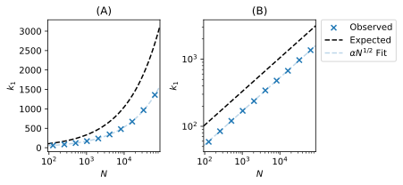
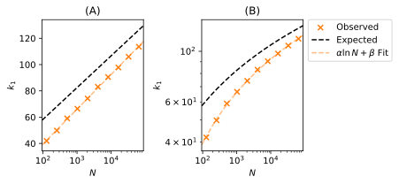
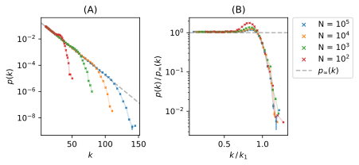

# Network Models

A Python implementation of three different network growth models: preferential attachment, random attachment and the existing vertices method. Based on work done for a master's module in complexity theory and networks at Imperial College with Prof. Kim Christensen and Prof. Tim Evans. 

An abreviated versoin of the final paper can be read [here](https://github.com/bdgrichards/network-models/blob/d91e52a59681e33e408df16779a74de7fcdafbd3/paper.pdf).

## Figures

These won't mean much without reading that paper...

--- 

The preferential attachment degree distribution, $p(k)$ against $k$ for $N = 10,000$ and multiple values of $m$, (A), and $p(k) \, / \, 2m(m+1)$ against $k$, for all $p(k) > 10^{-4}$, to collapse the scaling regions onto one another, (B). Each combination of parameters was repeated 100 times, and the resulting data were logarithmically binned. Error bars on both plots display the standard error on the mean of each bin, although they are only large enough to be visible for the largest values of $k$ in (A). Good visual agreement can be seen between the expected and observed data in (B).

--- 

Expected and observed $k_1$ as a function of $N$ for $m=10$, for preferential attachment on linear-log axes (A) and log-log axes (B) for direct comparison to the random attachment model. The function $\alpha N^{1/2}$ was fit to the observed data, where $\alpha$ is some constant found to be $5.31 \pm 0.01$, approximately half of 10.5, the expected value. Each data point is the average of 100 calculations. Errors in $k_1$ are not plotted, as they would be too small to see, with values ranging from 0.3 to 0.05. The observed scaling behaviour of $k_1$ matches that expected.

--- 

The degree distribution for preferential attachment, $p(k)$, against $k$ for $m=10$ and various $N$, (A), and the associated data collapse of the same data, (B), which is visually found to be of good quality. Each combination of parameters was repeated 100 times and the resulting data were logarithmically binned. Error bars indicate the standard error on each logarithmically binned mean, but other than in the tail of the data collapse, they are too small to see.

--- 

Degree distribution, $p(k)$, against $k$ for random attachment, with $N=10,000$ and various $m$, (A), and the section of $m=128$ data truncated at $k=500$ against which the $\chi^2$ test was performed, (B), with good visual agreement. Dashed lines show the expected distributions, with line colour corresponding to $m$ value. Each value of $m$ is run for 100 repetitions. Errors are not plotted, since they would be too small to see, with values for $p(k)$ ranging from $6.5 \times 10^{-5}$ to $4.4 \times 10^{-7}$.

--- 

Expected and observed $k_1$ as a function of $N$ for $m=10$, for random attachment on linear-log axes (A) and log-log axes (B) for direct comparison to the preferential attachment model. Each value is the mean of 100 calculations. The function $\alpha \ln(N) + \beta$ was fit to the observed values, with parameters found to be $\alpha = 11.5 \pm 0.1$, higher than the expected value of 10.5, and $\beta = -13.3 \pm 0.7$, lower than the expected value of 10. Errors in $k_1$ are not plotted as they would be too small to see, with values ranging from $5\times 10^{-2}$ to $3 \times 10^{-2}$.

--- 

The degree distribution for random attachment, $p(k)$ against $k$ for $m=10$ and various $N$, (A), and the associated data collapse, (B), which is visually found to be of reasonable quality. Each combination of parameters was repeated 1,000 times, and the resulting data were logarithmically binned. Error bars indicate the standard error on each logarithmically binned mean, but other than in the tail of the distribution, they are too small to be seen.

--- 

The existing vertices model degree distribution, $p(k)$ for $n = 10,000$ and various $m$, (A), and the section of $m=3$ data, truncated at $k=15$, against which the $\chi^2$ test was performed, (B), with good visual agreement. Dashed lines show the expected distributions, with colour corresponding to $m$ value. Each combination of parameters was run for 100 repetitions and data was logarithmically binned. Errors are not plotted, as they would be too small to see, with values for $p(k)$ ranging from $2.2 \times 10^{-5}$ to $1.2 \times 10^{-8}$.

--- 

Degree distribution for the existing vertices model, $p(k)$, against $k$ for $m = 12$, $r=4$ and various $N$, (A), and the associated data collapse, (B), which breaks down for $N=100$ as $m$ approaches $N$. Each combination of parameters was repeated 100 times, and the resulting data were logarithmically binned. Errors are not plotted as they would be too small to see, with values ranging from $1.7 \times 10^{-5}$ to $1.2 \times 10^{-9}$.

